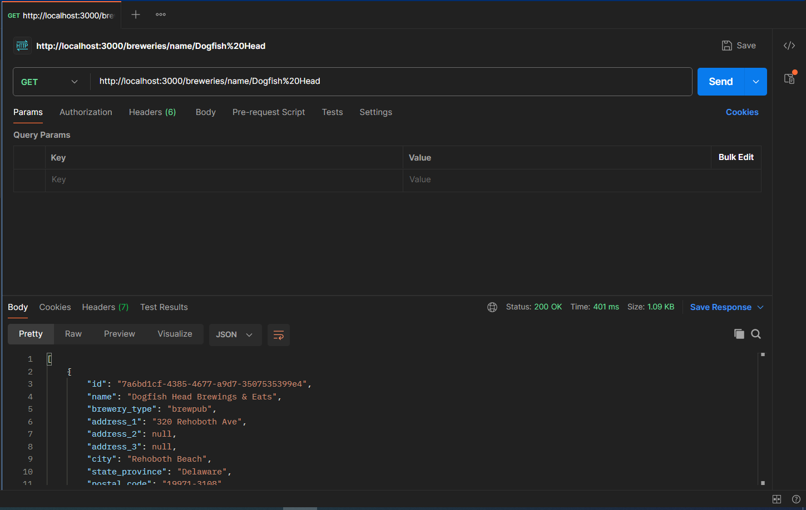

# Documentation-API_Controle
## API de recherche d'information de bar / Search API about bar informations 
:fr: Ceci est une api de recherche d'informations sur les bar en vu d'un controle en 2eme année d'école d'ingénieur.

Voici le lien de l'api : https://openbrewerydb.org/

:gb: This is a search api about bar informations for a 2nd year in computer science's school. 

Here is the api link : https://openbrewerydb.org/

### Fonctionnalites Principales / Main functionalities
:fr: 

- Afficher la liste de tous les bars disponibles (uniquement dans les USA)
- Afficher les informations d'un bar en fonction de son identifiant
- Afficher les bars d'une ville
- Afficher les informations d'un bar avec son nom

:gb: 

- List of all available bars (Uniquely in the USA)
- Show the informations of a bar by his id
- Bar list of a city
- Show the informations of a bar by his name

### Instructions d'installation / Installation instructions
:fr: 

1. Clonez le depot : `git clone https://github.com/MathieuAudibert/Documentation-API_Controle`
2. Installer les dependances : `npm install`
    - -> Installer typescript : `npm install typescript --save-dev`,
    - -> Installer axios : `npm install axios`,
    - -> Installer les librairies express et node : `npm install @types/express @types/node`
    - -> Installer la librairie swagger : `npm install swagger-ui-express swagger-jsdoc`
3. Lancer Postman 
    - -> [Lien pour telecharger postman](https://www.postman.com/downloads/)

:gb:

1. Clone the repository : `git clone https://github.com/MathieuAudibert/Documentation-API_Controle`
2. Install dependencies : `npm install`
    - -> Install typescript : `npm install typescript --save-dev`,
    - -> Install axios : `npm install axios`,
    - -> Install express & node librairies : `npm install @types/express @types/node`
    - -> Install swagger : `npm install swagger-ui-express swagger-jsdoc`
3. Use Postman 
    - -> [Link to download postman](https://www.postman.com/downloads/)

### Configuration Requise / Required Configuration
-    "axios": "^1.6.7",
-    "dotenv": "^16.4.1",
-    "express": "^4.18.2",
-    "swagger-jsdoc": "^6.2.8",
-    "swagger-ui-express": "^5.0.0",
-    "ts-node": "^10.9.2"

### Exemples D'utilisation / Usage examples
#### Example 1 (Show all the bars in a city) : 

:fr: Lancer le server a l'aide de : `npm start`
- Lancez postman et cliquez sur `skip` a chaque question
- Dans la barre de recherche, mettez `http://localhost:3000/breweries` --> cliquez sur `send`

:gb: Start the server with : `npm start`
- Start postman and click on `skip` on every question
- In the search bar, put `http://localhost:3000/breweries` --> click on `send`

#### Example 2 (Show the informations of a bar by his id) :
:fr: - Dans postman mettez `http://localhost:3000/breweries/<mettez-l-id>`

:gb: - In postman put `http://localhost:3000/breweries/<put-the-id>`

#### Example 3 (List all the bar of a city) : 
:fr: - Dans postman mettez `http://localhost:3000/breweries/city/villeexemple`
- Vous pouvez retrouver [toutes les villes disponibles ici](https://openbrewerydb.org/breweries)

:gb: - In postman put `http://localhost:3000/breweries/city/cityexample`
- You can find [all the available cities here](https://openbrewerydb.org/breweries) 

#### Example 4 (Show the information of a bar by his name) : 
:fr: - Dans postman mettez `http://localhost:3000/breweries/name/Exemple`
- Vous pouvez retrouver [tous les bar disponibles ici](https://openbrewerydb.org/breweries)
- /!\ Espace se note `%`

:gb: - In postman put `http://localhost:3000/breweries/name/Example`
- You can find [all the available bars here](https://openbrewerydb.org/breweries) 
- /!\ Space caracter is `%`

### Swagger
[Lien du swagger](http://localhost:3000/api-docs/) | 
[Swagger Link](http://localhost:3000/api-docs/)

### Nos adresses e-mail (pro) / Our e-mail adresses
mathieu.audibert@efrei.net
andrija.tomic@efrei.net